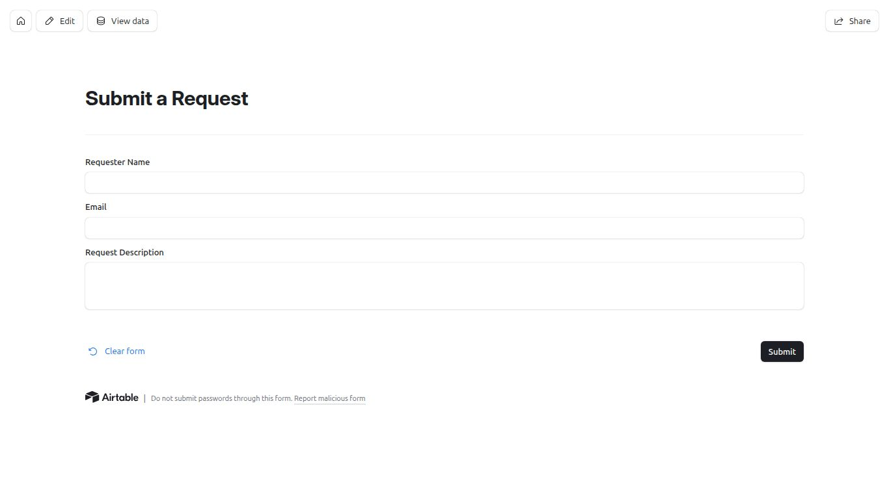

# Overview
A lightweight internal request intake and tracking system built using Airtable. Designed to centralize incoming requests, enforce workflow state control, and provide operational visibility. 

## Problem
Teams often receive requests through fragmented channels (email, chats, verbal communication), leading to lack of visibility, inconsistent status tracking, and operational bottlenecks. 
## Solution
A structured intake form feeds directly into a controlled Requests table. Workflow state is internally managed, and real-time reporting provides visibility into workload distribution.
## Architecture
Form -> Airtable Base(Default State Initialization) -> Interface Dashboard -> Automation(event-driven email notification)
## Design Decisions
- Status is system-controlled, not user-controlled
- Default field values used instead of automation for state initialization
- Automations triggered on record creation (date event), not form submission (UI event)
- Reporting implemented via aggregated metrics
## Impact
- Centralized intake
- Reduced manual triage
- Real-time visibility
- Extensible architecture for future enhancements
## Form Example

